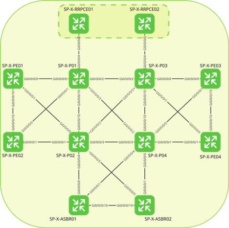

# SP-X Interface configuration

This Terraform code configures all the point-to-point links required to run the topology below as also its loopback IPs.

Please adjust the variables file to adapt to your environment.

If you're running Cisco CML, you can use the code here [https://github.com/tiagosil-cisco/sp-x-cml-terraform]() to facilitate your CML topology deployment.
